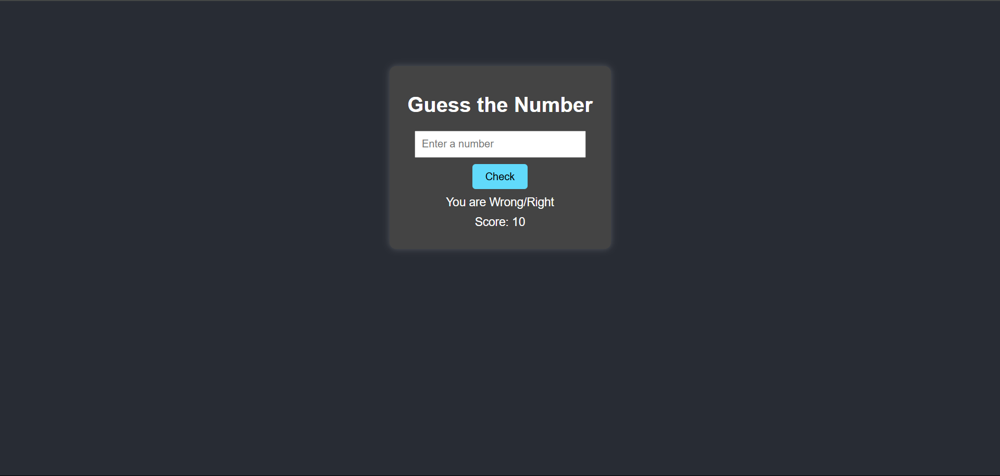

# Guess the Number Game

This is a simple web-based game where the player tries to guess a randomly generated number between 1 and 10.

## How to Play
1. Enter a number between 1 and 10 in the input box.
2. Click the "Check" button to see if your guess is correct.
3. If correct, you win! If not, your score decreases by 1.
4. The game ends when the score reaches 0, revealing the correct number.

## Features
- Dark-themed UI with a clean design
- Real-time feedback on guesses
- Simple and interactive gameplay

## Installation
1. Clone this repository:
   ```bash
   git clone https://github.com/your-username/guess-the-number-game.git
   ```
2. Navigate to the project folder:
   ```bash
   cd guess-the-number-game
   ```
3. Open `index.html` in a web browser to play the game.

## Technologies Used
- HTML
- CSS
- JavaScript

## Screenshot


## Contributing
Feel free to submit issues or pull requests if you would like to improve the game!

## License
This project is licensed under the MIT License.
